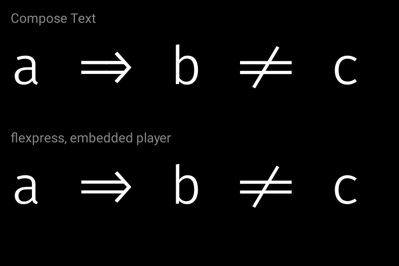
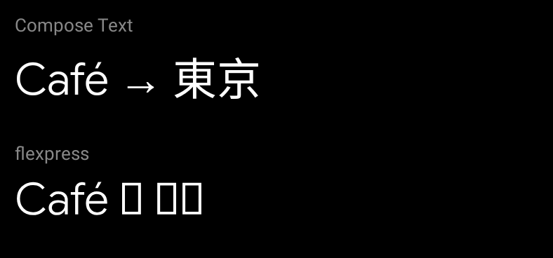
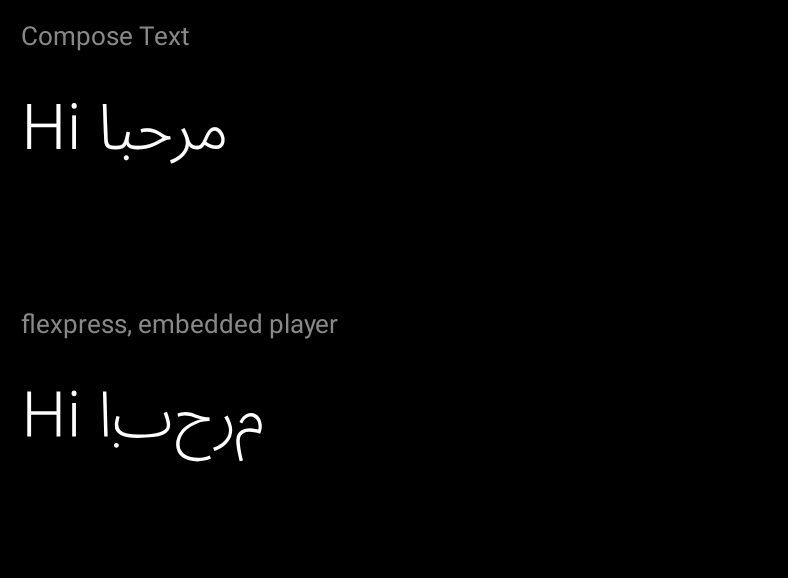
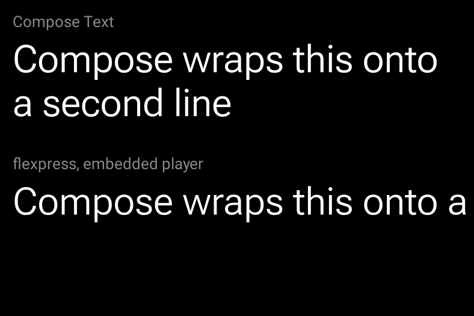

# Flexpress

Animate variable-font axes — weight, width, slant, roundness, grade — without ever loading or
re-instancing a font: the font's own variation model, evaluated as the text is drawn.

- `flexpress-core`: a small variable-font reader and the precomputed text outline.
- `flexpress-remote`: Remote Compose (`RemoteVariableFontText`).
- `flexpress-compose`: Jetpack Compose UI (`VariableFontText`).
- `flexpress-codegen`: work an outline out at build time so the app needs no font
  ([recipe](flexpress-codegen/README.md)).

```kotlin
// Remote Compose: the axes are RemoteFloats, evaluated by the player.
RemoteVariableFontText("Hello", font, mapOf("wght" to weight), fontSize = 32.rdp)

// Compose UI: the axes are read at draw time, so animating them never recomposes.
VariableFontText("Hello", font, mapOf("wght" to { weight.value }), fontSize = 32.sp)
```

Module READMEs: [`flexpress-remote`](flexpress-remote/README.md) (how the variation model becomes
Remote Compose expressions, the players it is checked against, document sizes, the sizzle reel) and
[`flexpress-compose`](flexpress-compose/README.md). The test fonts and their licences are described
in [`fonts/README.md`](fonts/README.md).

## Limitations

Flexpress draws one line of text as a path from one font's outlines, placing glyphs by their
advances and the font's pair kerning. That is what lets the axes animate without the player ever
loading a font, and it is also what it gives up against platform text. The animations below are the
`Limitation*Preview`s in `flexpress-remote`: Compose `Text` on top, re-instancing its font with new
variation settings on every frame (with `TextMotion.Animated`), and `RemoteVariableFontText` below,
played by the embedded Compose player (`RcPlayer`) at the same animated weight.
The preview workflow renders them on every pull request, so a change to any of these behaviours
shows up in its diff.

### Ligatures and contextual alternates: `String` text only

Text given as a `String` is shaped with the font's `GSUB` lookups for the features a shaper applies
by default (`ccmp`, `locl`, `rlig`, `liga`, `clig`, `calt`), checked glyph for glyph against
HarfBuzz. Below, Fira Code's `=>` and `!=` become ⇒ and ≠ in both. Optional features (stylistic
sets, discretionary ligatures) are not applied, and glyphs are chosen once, at one design-space
location, so a font that swaps glyphs as an axis moves (`GSUB` feature variations) keeps the glyphs
it starts with. `RemoteString` text, which the player assembles one character at a time, is not
shaped.



### No font fallback

Every character is drawn from the one font. A character the font lacks is drawn as its `.notdef`
glyph, usually an empty box, where Compose would fall back to a system font. Subset fonts make this
easy to hit: choose the font's character coverage for the text you will draw.



### Right to left and Arabic joining, but no mark positioning

Bidirectional text is split into runs and placed in visual order, with brackets mirrored in
right-to-left runs. Arabic and Syriac letters take their positional (initial, medial, final,
isolated) forms by the Unicode joining algorithm, checked against HarfBuzz. Marks, such as Arabic
vowel marks and the dots some fonts draw as separate glyphs, are not yet positioned (`GPOS` is read
for pair kerning only), so they sit where the font's default places them, and Indic scripts are not
reordered. Below, both draw Noto Sans Arabic, joined, right to left.



### One line, no wrapping

The text is a single line, as wide as its widest advance over the animated range. Nothing wraps, and
a narrower container clips it. Break lines yourself and draw one `RemoteVariableFontText` per line.



### `RemoteString` text: Basic Multilingual Plane only

Text that changes on the player (the `RemoteString` overload with `rememberVariableFontGlyphs`) is
split by the player into UTF-16 units. A character outside the Basic Multilingual Plane, such as most
emoji, is a surrogate pair that no glyph can match, so `rememberVariableFontGlyphs` rejects one in
`characters` with an error naming it. The `String` overloads have no such limit beyond the font's own
coverage. The `RemoteString` path also needs every possible character listed up front, and a
`maxLength`.

### Font format

TrueType (`glyf`) outlines only, not CFF2. Composite glyphs must place their components by offset; a
composite that anchors a component by point matching is rejected when it is drawn.

### Accessibility and rasterization

The text is drawn as a filled path. `RemoteVariableFontText` carries no accessible text, so give it
one with `RemoteModifier.semantics { contentDescription = RemoteString("…") }`; in Compose UI, `VariableFontText` from a font and string
exposes its text to accessibility services, while the precomputed-outline overload does so only
through its `contentDescription`. Edges are anti-aliased as a path fill, not by the platform's text
rasterizer: light weights at small sizes look lighter than platform text, which thickens thin stems.

### Document size grows with animated axes

This is a cost rather than a limit. When exactly one axis is animated and its variation regions do
not overlap, as is usual, the document holds a few whole key outlines and draws a single tween
between the default outline and one key: small, and cheap for the player. With two or more animated
axes, the regions multiply, so each outline coordinate becomes an expression over all the axes
instead, and the document grows with every axis added. Animate only the axes that move and hold the
rest with `location`. See [How](flexpress-remote/README.md#how).

## Using

Published to Maven Central as `ee.schimke.flexpress:flexpress-remote`, `flexpress-compose`,
`flexpress-core` and `flexpress-codegen`, all at one version.

## Building

```
./gradlew ktfmtFormat test lintDebug
./gradlew composePreviewRender   # the debug previews, as PNGs and GIFs
```

Remote Compose is `androidx.compose.remote` 1.0.0-alpha21. Contributor and agent rules are in
[`AGENTS.md`](AGENTS.md).
